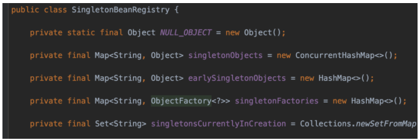
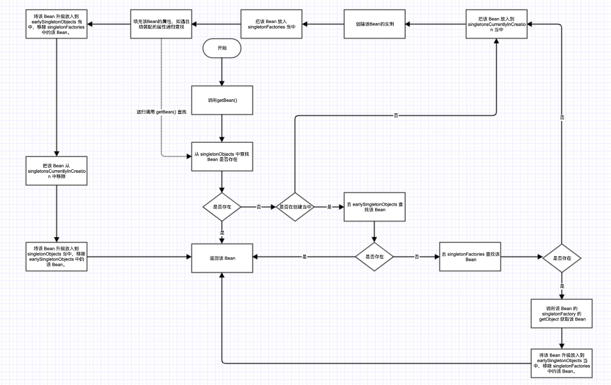
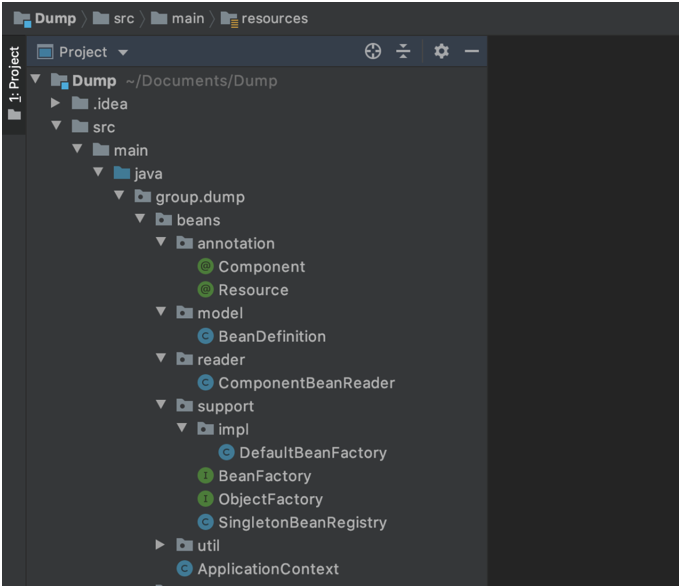

## Spring IOC

------

今天再战 Spring IOC ，根据 Spring 源码写一个带有三级缓存的 IOC。

## **Spring 中的 IOC**

Spring 的 IOC 其实很复杂，因为它支持的情况，种类，以及开放的接口，拓展性（如各种PostProcessor）太丰富了。这导致我们在看 Spring 源码的过程中非常吃力，经常点进去一个函数发现很深很深。这篇我主要针对 Spring 的 IOC 中的核心部分，例如 Spring 的 IOC 是如何实现的，Spring 是如何解决循环依赖的这类问题做一个介绍以及一份实现，因为原理是相通的，对于 Spring 对各种情况的逻辑上的处理不做细致的讨论，对原型模式，或是 FactoryBean 类型的 Bean 的不同处理方式不做具体实现。

## **本文将实现一个怎样的 IOC**

1. 仅支持 Singleton 单例模式的 Bean 管理。（这也是我们在平时项目中最常用的模式）
2. 仅支持 无参构造器的 Bean 的管理。（这部分如果实现支持有参构造器的也很简单，后续可能会补充）
3. 仅支持 按照 BeanName 的方式加载 Bean 的方式，如果遇到 Class 的情况，将获取Class 的 SimpleName 后继续按照 BeanName 的方式加载。（这里类似于在 Spring 当中使用 @AutoWaired 按类型匹配不到的情况依然会按照 Name 的方式去匹配）
4. 支持 自动装配，并完美解决循环依赖问题。

## **流程设计**

### **基础流程设计**

如果不考虑循环依赖的问题，不考虑三级缓存的情况下，实现我们这样一个IOC的功能很简单：

1. 加载所有的需要被我们管理的 Bean（被 @Component 修饰的类），转换成 Bean 的定义（BeanDefinition，后面会说），存放在 Map 中。
2. 利用反射得到这些 Bean 的实例，将这些 Bean 的实例存储在我们的容器内。
3. 填充我们需要自动装配的属性（被 @Resource 修饰的属性）。

完成以上三步，就可以在外层容器调用 getBean() 方法获取 Bean 的实例了。

### **如何解决循环依赖**

网上关于 Spring 如何解决循环依赖的文章很多，简单来说就是利用缓存，先将没有填充属性的对象缓存起来，需要的时候先去用这个对象，不必等待一个对象完整的初始化好。而为什么是三级缓存不是二级缓存呢，这里笼统的来说还是方便 Spring 或者开发者们去拓展一些东西，例如在 Spring Bean 的生命周期中有很多的 Processor，这个我们后续再讲。关于这部分的细节上的逻辑，在后面介绍完三级缓存会有一个很详细的流程图。

### **三级缓存**

三级缓存的实现在代码中的 SingletonBeanRegistry 中：



其中有以下几个核心属性：

1. singletonObjects：一级缓存，用于存放完全初始化好的 bean，从该缓存中取出的 bean 可以直接使用。
2. earlySingletonObjects：二级缓存，用于存放提前曝光的单例对象的cache，原始的 bean 对象（尚未填充属性）。
3. singletonFactories：三级缓存，用于存放 bean 工厂对象（ObjectFactory）。三级缓存中用到了 ObjectFactory，这里的 ObjectFactory 可以理解为三级缓存中 Bean 的代理对象，其 getObject() 方法描述了如何获取这个三级缓存的对象。设计成这样除了方便实现三级缓存解决循环依赖，另外也是方便 Spring 在 ObjectFactory 中做一些拓展。
4. singletonsCurrentlyInCreation：用于存放正在被创建的 Bean 对象。

### **流程图（重要）** 



## **代码设计**



### BeanFactory（参考自 Spring 的 BeanFactory）

和 Spring 一样，这是 IOC 相关的顶级接口，里面包含了获取 Bean，判断 Bean 是否存在的定义。

```java
public interface BeanFactory {
    Object getBean(String name);
    <T> T getBean(Class<T> requiredType);
    boolean containsBean(String name);
}

```

### SingletonBeanRegistry（参考自 Spring 的 DefaultSingletonBeanRegistry）

单例 Bean 的注册中心，里面包含了所有 Bean 的实例以及所有 Bean 实例的缓存，以及获取单例 Bean 的逻辑，这个类的方法结合 DefaultBeanFactory 中的 getBean() 调用链就是上面流程图的全部内容。

```java
public class SingletonBeanRegistry {
    private static final Object NULL_OBJECT = new Object();
    private final Map<String, Object> singletonObjects = new ConcurrentHashMap<>();
    private final Map<String, Object> earlySingletonObjects = new HashMap<>();
    private final Map<String, ObjectFactory<?>> singletonFactories = new HashMap<>();
    private final Set<String> singletonsCurrentlyInCreation = Collections.newSetFromMap(new ConcurrentHashMap<>());
    protected Object getSingleton(String beanName) {
        Object singletonObject = this.singletonObjects.get(beanName);
        if (singletonObject == null && isSingletonCurrentlyInCreation(beanName)) {
            synchronized (this.singletonObjects) {
                singletonObject = this.earlySingletonObjects.get(beanName);
                if (singletonObject == null) {
                    ObjectFactory<?> singletonFactory = this.singletonFactories.get(beanName);
                    if (singletonFactory != null) {
                        singletonObject = singletonFactory.getObject();
                        this.earlySingletonObjects.put(beanName, singletonObject);
                        this.singletonFactories.remove(beanName);
                    }
                }
            }
        }
        return (singletonObject != NULL_OBJECT ? singletonObject : null);
    }
    protected Object getSingleton(String beanName, ObjectFactory<?> singletonFactory) {
        synchronized (this.singletonObjects) {
            Object singletonObject = this.singletonObjects.get(beanName);
            if (singletonObject == null) {
                this.singletonsCurrentlyInCreation.add(beanName);
                singletonObject = singletonFactory.getObject();
                this.singletonsCurrentlyInCreation.remove(beanName);
                addSingleton(beanName, singletonObject);
            }
            return (singletonObject != NULL_OBJECT ? singletonObject : null);
        }
    }
    protected void addSingleton(String beanName, Object singletonObject) {
        synchronized (this.singletonObjects) {
            this.singletonObjects.put(beanName, (singletonObject != null ? singletonObject : NULL_OBJECT));
            this.singletonFactories.remove(beanName);
            this.earlySingletonObjects.remove(beanName);
        }
    }
    protected void addSingletonFactory(String beanName, ObjectFactory<?> singletonFactory) {
        synchronized (this.singletonObjects) {
            if (!this.singletonObjects.containsKey(beanName)) {
                this.singletonFactories.put(beanName, singletonFactory);
                this.earlySingletonObjects.remove(beanName);
            }
        }
    }
    protected void removeSingleton(String beanName) {
        synchronized (this.singletonObjects) {
            this.singletonObjects.remove(beanName);
            this.singletonFactories.remove(beanName);
            this.earlySingletonObjects.remove(beanName);
        }
    }
    protected boolean isSingletonCurrentlyInCreation(String beanName) {
        return this.singletonsCurrentlyInCreation.contains(beanName);
    }
    protected boolean containsSingleton(String name) {
        return this.singletonObjects.containsKey(name);
    }
}

```

### **DefaultBeanFactory（参考自 Spring 的 DefaultListableBeanFactory）**

BeanFactory 的一个实现，继承了 SingletonBeanRegistry ，同时也作为一个成员变量存在于 ApplicationContext 当中。getBean() 是入口，其调用链为：

getBean()->doGetBean()获取Bean如果不存在则创建->doCreateBean()->createBeanInstance()创建 Bean 的实例->populateBean()实现Bean属性的自动装配。（在 Spring 中多了一步 createBean() 用于实现 AOP，和一步 initalizeBean() 用于执行后置处理器和 init-method，这里我们都暂不实现）

```java
public class DefaultBeanFactory extends SingletonBeanRegistry implements BeanFactory {
    private final Map<String, BeanDefinition> beanDefinitionMap = new ConcurrentHashMap<>();
    public void registerBeanDefinition(String beanName, BeanDefinition beanDefinition) {
        this.beanDefinitionMap.put(beanName, beanDefinition);
    }
    public void preInstantiateSingletons() {
        this.beanDefinitionMap.forEach((beanName, beanDef) -> {
            getBean(beanName);
        });
    }
    @Override
    public Object getBean(String name) {
        return doGetBean(name);
    }
    private <T> T doGetBean(final String beanName) {
        Object bean;
        Object sharedInstance = getSingleton(beanName);
        if (sharedInstance != null) {
            bean = sharedInstance;
        } else {
            BeanDefinition beanDefinition = this.beanDefinitionMap.get(beanName);
            if (beanDefinition == null) {
                throw new DumpException("can not find the definition of bean '" + beanName + "'");
            }
            bean = getSingleton(beanName, () -> {
                try {
                    return doCreateBean(beanName, beanDefinition);
                } catch (Exception ex) {
                    removeSingleton(beanName);
                    throw ex;
                }
            });
        }
        return (T) bean;
    }
    private Object doCreateBean(String beanName, BeanDefinition beanDefinition) {
        Object bean = createBeanInstance(beanName, beanDefinition);
        boolean earlySingletonExposure = isSingletonCurrentlyInCreation(beanName);
        if (earlySingletonExposure) {
            addSingletonFactory(beanName, () -> bean);
        }
        Object exposedObject = bean;
        populateBean(beanName, beanDefinition, bean);
        if (earlySingletonExposure) {
            Object earlySingletonReference = getSingleton(beanName);
            if (earlySingletonReference != null) {
                exposedObject = earlySingletonReference;
            }
        }
        return exposedObject;
    }
    private Object createBeanInstance(String beanName, BeanDefinition beanDefinition) {
        Class<?> beanClass = beanDefinition.getBeanClass();
        Constructor<?> constructorToUse;
        if (beanClass.isInterface()) {
            throw new DumpException("Specified class '" + beanName + "' is an interface");
        }
        try {
            constructorToUse = beanClass.getDeclaredConstructor((Class<?>[]) null);
            return BeanUtils.instantiateClass(constructorToUse);
        } catch (Exception e) {
            throw new DumpException("'" + beanName + "',No default constructor found", e);
        }
    }
    private void populateBean(String beanName, BeanDefinition beanDefinition, Object beanInstance) {
        Field[] beanFields = beanDefinition.getBeanClass().getDeclaredFields();
        try {
            for (Field field : beanFields) {
                if (field.getAnnotation(Resource.class) == null) {
                    continue;
                }
                if (!containsBean(field.getName())) {
                    throw new DumpException("'@Resource' for field '" + field.getClass().getName() + "' can not find");
                }
                field.setAccessible(true);
                field.set(beanInstance, getBean(field.getName()));
            }
        } catch (Exception e) {
            throw new DumpException("populateBean '" + beanName + "' error", e);
        }
    }
    private boolean containsBeanDefinition(String name) {
        return beanDefinitionMap.containsKey(name);
    }
    @Override
    @SuppressWarnings("unchecked")
    public <T> T getBean(Class<T> requiredType) {
        return (T) getBean(StringUtils.lowerFirst(requiredType.getSimpleName()));
    }
    @Override
    public boolean containsBean(String name) {
        return this.containsSingleton(name) || containsBeanDefinition(name);
    }
}

```

### **ApplicationContext**

应用的最外层容器，利用内部的 DefaultBeanFactory 对象实现了 BeanFactory。在new ApplicationContext()时，会执行读取所有的 Bean 转化成 BeanDefinition，并对所有的 BeanDefinition 执行 getBean() 获取所有 Bean 的实例，存放在 SingletonBeanRegistry 当中。在 ApplicationContext 中调用 getBean() 其实就是调用 DefaultBeanFactory 中的 getBean()。

```java
public class ApplicationContext implements BeanFactory {
    private DefaultBeanFactory beanFactory = new DefaultBeanFactory();
    public ApplicationContext() {
        loadBeanDefinitions(beanFactory);
        finishBeanFactoryInitialization(beanFactory);
    }
    private void loadBeanDefinitions(DefaultBeanFactory beanFactory) {
        ComponentBeanReader beanReader = new ComponentBeanReader();
        beanReader.readBeanDefinition(beanFactory);
    }
    public void finishBeanFactoryInitialization(DefaultBeanFactory beanFactory) {
        beanFactory.preInstantiateSingletons();
    }
    @Override
    public Object getBean(String name) {
        return getBeanFactory().getBean(name);
    }
    @Override
    public <T> T getBean(Class<T> requiredType) {
        return getBeanFactory().getBean(requiredType);
    }
    @Override
    public boolean containsBean(String name) {
        return getBeanFactory().containsBean(name);
    }
    public DefaultBeanFactory getBeanFactory() {
        return beanFactory;
    }
}


```

### **BeanDefinition（参考自 Spring 的 BeanDefinition）**

Bean 的描述，理论上应包含很多 Bean 的信息，但目前的实现只存了一个该 Bean 的 Class。

```java
public class BeanDefinition {
    private volatile Class<?> beanClass;
    public Class<?> getBeanClass() {
        return beanClass;
    }
    public void setBeanClass(Class<?> beanClass) {
        this.beanClass = beanClass;
    }
}
```

### **ComponentBeanReader（参考自 Spring 的 XmlBeanDefinitionReader）**

用于初始化 ApplicationContext 时，读取所有的 Bean，转化为 BeanDefinition。

```java
public class ComponentBeanReader {
    public void readBeanDefinition(DefaultBeanFactory beanFactory) {
        Set<Class<?>> componentSet = ReflectionUtils.getAllClass(Component.class);
        componentSet.forEach((componentClass) -> {
            BeanDefinition beanDefinition = new BeanDefinition();
            String beanName = componentClass.getAnnotation(Component.class).value();
            if ("".equals(beanName)) {
                beanName = StringUtils.lowerFirst(componentClass.getSimpleName());
            }
            beanDefinition.setBeanClass(componentClass);
            beanFactory.registerBeanDefinition(beanName, beanDefinition);
        });
    }
}

```

## **测试**

```java
@Component
class A{
    @Resource
    private B b;
@Component
class A{
    @Resource
    private B b;
    public void setB(B b) {
        this.b = b;
    }
    public B getB() {
        return b;
    }
}
@Component
class B{
    @Resource
    private A a;
    public void setA(A a) {
        this.a = a;
    }
    public A getA() {
        return a;
    }
}
@Component
class C{
    
    @Resource
    private A a;
    @Resource
    B b;
    public A getA() {
        return a;
    }
    public void setA(A a) {
        this.a = a;
    }
    public B getB() {
        return b;
    }
    public void setB(B b) {
        this.b = b;
    }
}
public class Test {
    public static void main(String[] args) {
        ApplicationContext context = new ApplicationContext();
        A a = context.getBean(A.class);
        B b = context.getBean(B.class);
        C c = (C)context.getBean("c");
        System.out.println(a.getB());
        System.out.println(b.getA());
        System.out.println(c.getA());
        System.out.println(c.getB());
    }
}
```

## **最后**

以上就是对 Spring 中单例 Bean 管理的一个简单实现，代码中比较难懂的部分是三级缓存的部分，对于三级缓存的详细流程和介绍其实全部都在上面的流程图里，如果看懂了流程图再看代码就会觉得很简单了。

同时这部分代码也会作为我实现的一个 web 框架 Dump 的一部分：Dump - A lightweight web framework：https://github.com/yuanguangxin/Dump

最后附上关于这部分实现的完整代码：

https://github.com/yuanguangxin/Dump/tree/master/src/main/java/group/dump/beans

**作者**

本文作者「袁广鑫」，欢迎关注作者的知乎：https://www.zhihu.com/people/yuan-yan-xin-53 专注于 Java 技术分享，点击阅读原文即可关注。