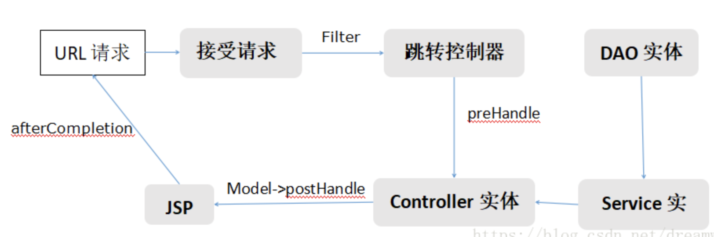

# Spring 过滤器 拦截器 AOP区别

# 简介

这几天在回顾Spring的AOP时，对过滤器，拦截器，AOP的关系有点好奇，故记录做以备份。在实现一些公共逻辑的时候，很多功能通过过滤器，拦截器，AOP都能实现，但是不同的方式有不同的效率。具体有什么区别，看下文描述。

# 前后端交互基本逻辑

# 

## 过滤器

过滤器拦截的是URL
Spring中自定义过滤器（Filter）一般只有一个方法，返回值是void，当请求到达web容器时，会探测当前请求地址是否配置有过滤器，有则调用该过滤器的方法（可能会有多个过滤器），然后才调用真实的业务逻辑，至此过滤器任务完成。过滤器并没有定义业务逻辑执行前、后等，仅仅是请求到达就执行。
特别注意：过滤器方法的入参有request，response，FilterChain，其中FilterChain是过滤器链，使用比较简单，而request，response则关联到请求流程，因此可以对请求参数做过滤和修改，同时FilterChain过滤链执行完，并且完成业务流程后，会返回到过滤器，此时也可以对请求的返回数据做处理。

## 拦截器

拦截器拦截的是URL

拦截器有三个方法，相对于过滤器更加细致，有被拦截逻辑执行前、后等。Spring中拦截器有三个方法：preHandle，postHandle，afterCompletion。分别表示如下

public boolean preHandle(HttpServletRequest httpServletRequest, HttpServletResponse httpServletResponse, Object o)表示被拦截的URL对应的方法执行前的自定义处理

public void postHandle(HttpServletRequest httpServletRequest, HttpServletResponse httpServletResponse, Object o, ModelAndView modelAndView)表示此时还未将modelAndView进行渲染，被拦截的URL对应的方法执行后的自定义处理，。

public void afterCompletion(HttpServletRequest httpServletRequest, HttpServletResponse httpServletResponse, Object o, Exception e)表示此时modelAndView已被渲染，执行拦截器的自定义处理。

## AOP（面向切面）

面向切面拦截的是类的元数据（包、类、方法名、参数等）

相对于拦截器更加细致，而且非常灵活，拦截器只能针对URL做拦截，而AOP针对具体的代码，能够实现更加复杂的业务逻辑。具体类型参照其他博客。

## 三者使用场景

三者功能类似，但各有优势，从过滤器--》拦截器--》切面，拦截规则越来越细致，执行顺序依次是过滤器、拦截器、切面。一般情况下数据被过滤的时机越早对服务的性能影响越小，因此我们在编写相对比较公用的代码时，优先考虑过滤器，然后是拦截器，最后是aop。比如权限校验，一般情况下，所有的请求都需要做登陆校验，此时就应该使用过滤器在最顶层做校验；日志记录，一般日志只会针对部分逻辑做日志记录，而且牵扯到业务逻辑完成前后的日志记录，因此使用过滤器不能细致地划分模块，此时应该考虑拦截器，然而拦截器也是依据URL做规则匹配，因此相对来说不够细致，因此我们会考虑到使用AOP实现，AOP可以针对代码的方法级别做拦截，很适合日志功能。