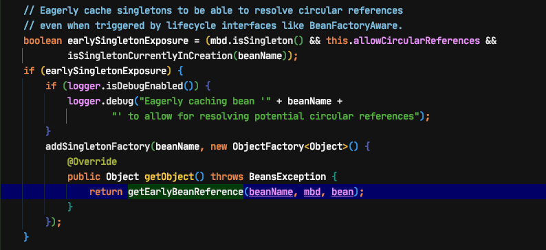
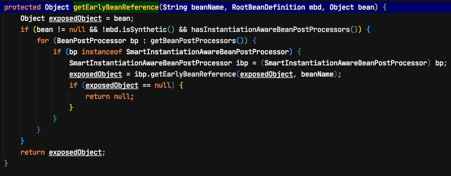
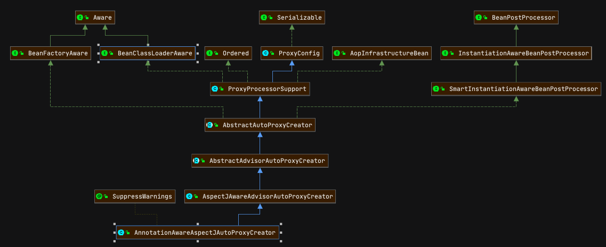

# spring为什么用三级缓存而不用二级缓存以及AOP注入类

A->B->A

这里AB我们假设必须是代理对象。

### 假设我们使用二级缓存

首先执行getBean ->doGetBean

```
T doGetBean(){
   Object sharedInstance = getSingleton(beanName);
   if (sharedInstance != null && args == null) {
       
   }else{
       //创建bean
       if (mbd.isSingleton()) {
           sharedInstance = getSingleton(beanName, () -> {
               return createBean(beanName, mbd, args);               
           });
           bean = getObjectForBeanInstance(sharedInstance, name, beanName, mbd);
       }
   }
}
```

getSingleton是去三级缓存中拿值，第一次拿不到会执行else 创建第一个A
createBean->doCreateBean

```
doCreateBean(){
    addSingletonFactory(beanName, () -> getEarlyBeanReference(beanName, mbd, bean));
    populateBean(beanName, mbd, instanceWrapper);
    exposedObject = initializeBean(beanName, exposedObject, mbd); 
}
```

addSingletonFactory

```
protected void addSingletonFactory(String beanName, ObjectFactory<?> singletonFactory) {
    Assert.notNull(singletonFactory, "Singleton factory must not be null");
    synchronized (this.singletonObjects) {
        if (!this.singletonObjects.containsKey(beanName)) {
            this.singletonFactories.put(beanName, singletonFactory);
            this.earlySingletonObjects.remove(beanName);
            this.registeredSingletons.add(beanName);
        }
    }
}
```

`singletonFactories 中添加第一个对象 A`
当A执行populateBean时，发现里面有个B对象需要创建，又执行B的 doGetBean
`singletonFactories 中有两个对象A、B`
当B执行populateBean时,发现里面有A,对象，这时执行doGetBean

```
Object sharedInstance = getSingleton(beanName);
```

`执行完毕后 earlySingletonObjects 中有个A singletonFactories中只有B`
因为singletonFactories中有A的 singletonFactory，singletonFactory执行 getObject 返回对象，不会在继续往下执行创建（在 getObject 时会调用lamada表达式中的后置处理器生成代理对象）
这时B获得了A,继续执行B的初始化，调用B的 initializeBean 执行后置处理器生成代理对象B
B创建完成后，第一个A继续执行初始化，但是由于A的后置处理器已经执行过了，第二次不会执行,直接返回Bean

```
public Object postProcessAfterInitialization(@Nullable Object bean, String beanName) {
    if (bean != null) {
        Object cacheKey = getCacheKey(bean.getClass(), beanName);
        if (this.earlyProxyReferences.remove(cacheKey) != bean) {
            return wrapIfNecessary(bean, beanName, cacheKey);
        }
    }
    return bean;
}
```

这样的话，A的创建就不会生成代理对象，显然不能这样设计，所以二级缓存就有问题。

### 为什么三级缓存可以？

在上述中加入三级缓存，在B继续执行时一句重要的代码

```java
	// Initialize the bean instance.
		Object exposedObject = bean;
		try {
			populateBean(beanName, mbd, instanceWrapper);
			if (exposedObject != null) {
				exposedObject = initializeBean(beanName, exposedObject, mbd);
			}
		}
		catch (Throwable ex) {
			if (ex instanceof BeanCreationException && beanName.equals(((BeanCreationException) ex).getBeanName())) {
				throw (BeanCreationException) ex;
			}
			else {
				throw new BeanCreationException(
						mbd.getResourceDescription(), beanName, "Initialization of bean failed", ex);
			}
		}

		if (earlySingletonExposure) {
			Object earlySingletonReference = getSingleton(beanName, false);
			if (earlySingletonReference != null) {
				if (exposedObject == bean) {
					exposedObject = earlySingletonReference;
				}
```

通过去拿取 earlySingletonObjects 中的A，这个A是后置处理器处理过的代理对象A,所有直接赋值给第一个A，则A，B都满足了代理对象。

####提前返回Bean AOP的实现





####继承类图



 AOP中注入的类就是SmartInstantiationAwareBeanPostProcesser类型